# Github
- Config files are global to the host
- 4 Stages of a File in Git 
- GIT Cheat Sheet 
- The repo from which current folder was cloned, that remote is given ```origin``` name by default
- Git can supported both Distributed VCS as well as Centralized VCS
- ``git branch -a -vv`` to see which local branch tracks which remote branch 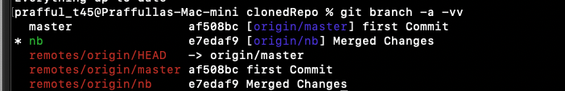
***

## Errors faced
- Support for password authentication was removed on August 13, 2021. Please use a personal access token instead.
    - Generate Personal Access Token and instead of entering password enter the generated PAT
- Prompt to enter Github username and password every time
    - Configure osxkeychain credential helper
    - ```https://www.atlassian.com/git/tutorials/install-git```
    - Store PAT Under Github Keychain Password
    - Now after you enter username and password for the first time
    - osxkeychain will get store the credentials and you don't need to enter uname and pwd each time you push to main

# Git Commands 
## git init
- Initializes a database in the ```.git folder```
- Repository is entirely stored within this ```.git folder```
- Files within ```.git folder```
    ``` 
    cd .git 
    ls
    ```
    - Files Present 
***

## HEAD File
- This file points to the current branch or commit ID you are currently on
- Inside this file (```cat HEAD```) you can find string ```refs/heads/currentBranch```, this an internal representation of ```currentBranch```
***

## Move HEAD to previous commit
- In order to do so, we'll need the commit hash
- ```git log``` command, copy the commit ID/commit HASH 
- ```git checkout commitHash```, this command will move the current head to particular commit 
- Now if you make changes here you won't be able to push it, as there is no branch created

	#### How to push changes from commitID
	- Add files and commit changes
	- You will get an associated commitID/Hash
	- Create branch out of this commit ID
	- ```git branch branchName commitID/Hash```
	- Now you can push these changes
***

## GIT Config File
- Config file stores info about repo's local configuration 
- ```
	cd .git
	cat config
  ``` 
- 
***

## git log
- Look at repositories history
- ``` git log ``` , hit space+down to scroll output pages
- ```git log oneline```, view the log is ```one line per commit```
- ```git log --oneline --graph```, get a visual representation of the history
***

## git status
- Retrieve Repo's current status, deleted/modified/created files
- ```Untracked Files``` => Git has detected that a file exists, but the repo isn't aware of it, add file to repo to make repo aware of it
***

## git add
- Tells git repo to starts tracking the file in the local index
- ```git add fileName```
- Adds a file to the index. It is ready to be committed to the repository.
- Still, the file won't have any history! Git has simply been made aware of the file, and you must make a commit to initiate Git’s history.
***

## git commit
- Tells Git to take a snapshot of all added content at this point.
- ``` git commit -m "Commit Message"
- Now changes made to this file can be seen by ```git diff``` command
***

## git diff
- Look at local file changes 
***

## Simultaneous Add and commit
- ```git commit -am "Commit Message"```
***

## git clone
- Create Local copies of git repositories to work with
***

## git reset
- Command to return to a prvious known state
- Types of reset in git
	- ```soft``` : only changes HEAD, but doesn’t change staged files in index or working files, just moves HEAD ,no alteration to added/staged files or modified files
	- ```mixed```: moves HEAD and updates the index with the contents of the revision to which HEAD now points
		- Takes items out of their added status but keeps them altered in the current working folder	--> ```default reset flag used```.
	- ```hard``` : --hard not only takes items out of their added status, but they also make the working tree state consistent with what was last committed. You can effectively lose your changes with the --hard flag.
***

## Removed files by mistake, Recover it !!
- ```rm -rf ../Git-Github/*```
- Above command deletes your cloned repo.
- But ```.git``` folder is skipped from deletion
- The ```*``` character does not match any file starting with ```.```
- Restore
	- ```git reset``` to recover the state of Git repo
	- By default, Git will recover whatever has been added to the index/staging area an place it in your working directory
	- ```git reset --hard```  will reset all local and added changes, reverting your checkout to a just-cloned and committed state.
***

## git branch
- ```git branch newBranch```
***

## git checkout
- Switch to a branch ```git checkout branchName```
***

## Detached 
- **Detaching**
	- The HEAD pointer can move to any arbitrary point, achieved by ```git checkout```
	- Specify a reference / commit ID 
	- ``` git checkout e36355ed00ac3af009d7113a9dd281c269a79afd```
	- **Detached HEAD** just means that the HEAD pointer is not pointed to any branch right now
	- Instead it is pointing to a commit ID
***

## Tags
- Tags are the same as branches, except they do not have history. They point to a particular commit, but it doesn't change
- ```git tag i_was_here```
***

## Merging
- Merging is the opposite of branching
- When you merge, you take two separate points in your development tree and fuse them together
- ```git merge firstBranchName secondBranchName```
- Pre Merge repo tree 
- Post Merge repo tree 
### Merge Conflicts
- When merging current branch ```A``` with another branch ```B```, git looks for the first common ancestor
- Git then takes the changes on the branch ```B``` that you are merging into from that ```first common ancestor``` and applies them to the branch you are on in one go.
- These changes create a new commit.
- Sometimes these changes conflict with each other, meaning both branches altered same lines, thus git throws a merge conflict error
- 3 type of arrows
    - ```<<<<<<<``` Marks First common ancestor, and the start of changes on current branch
    - ```=======``` Marks the junction of two branches, the current branch and the branch to be merged with
    - ```>>>>>>>``` Marks the end of changes in other branch
***

## git stash
- With ``stash`` concept, we can store all local changes and re-apply at will wherever needed
- ```do some work
    get interrupted
    git stash
    deal with interruption
    git stash pop```
- Changes are stores on a separate branch named ``ref/stash``
- Git commits the state of the index and then commits all current local changes to above branch
- “commit” message ``WIP on master`` and ``index on master`` is added automatically for the stash.
- And the HEAD pointer is moved back to previous commit before these local changes
- ``git stash list``
- Stash works on FIFO i.e., stack DS, hence latest stash changes are applied first
- ``git stash show --patch stash@{0}`` to see information about particular git stash
- ``git stash apply stash@{1}`` to apply a particular stash changes
- ``git stash drop`` will remove the stash item.
***

## Git Add Interactive
### git add -i command
- Opens up Git Interactive menu
- TBD
***

## Reflog
- Reflog gives you references to a sequential history of what you have done to the repository
- Git's reflog is a history of the changes made to the HEAD 
- Delete current commit by following commands
```  git checkout HEAD^
	 git branch -f currentBranch
	 git checkout currentBranch
	 git log
```
- Now you can see ```git log``` doesn't show your latest commit, and it's history is kind of lost
- This is where ```git reflog``` comes into picture, it tracks all the movements of HEAD pointer, and it contains references/commitID's to the state of the repository ay various points even in those points are no longer reachable within the repository
- ``` git reset --hard latestCommitID
	  git log
  ```
- Above command will help restore previous commit
***

## Cherry-Picking
- ``Port changes from one branch to another``
- Since every commit in Git is a change set with a reference ID, changes can be ported from one branch to another
- Use commit ID of which changes are to be brought into current branch
- ```git cherry-pick commitID```
- Above command might fail if ``diff`` operation can be applied, i.e., merge conflicts arise
**

## Git Rebase and Fast-Forwarding
- Concept of Git rebase is to overcome drawbacks of merging
- With ``Merging``, history can get complicated due to extra commits getting introduced
- And with rebase current branch can be deleted safely without any significant information being lost.
- Merging Scenarios
	- 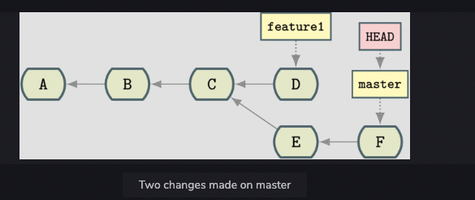
	- 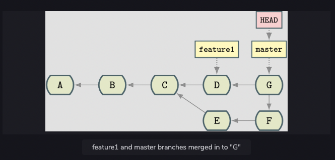
- With rebase 
	- 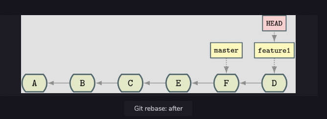
	- 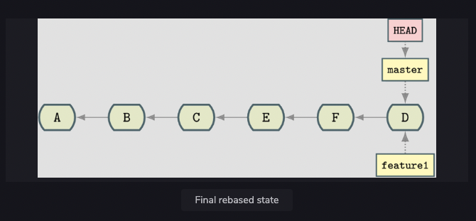
- ``What Rebasing Does``
	- ``git rebase master``, this command takes the changes from latest master branch commit and move them to currentBranch, which might result in merge conflicts
	- Afterr resolving merge conflicts do ``git rebase --continue`` to continue rebase operation
	- Now head is pointing to currentBranch, refer to After ``Rebase Image`` above
	- Now all the changes are in one tree line, now merge ``current branch`` into ```master branch``` by ``git merge branchName`` command
	- Because the changes are in a line, there aren’t any new changes that need to be made. The master branch pointer merely needs to be “fast-forwarded” to the same point as feature1!
	- Boom!! You are in the desired state of ``After Fast Forward`` image above
**

## Git Bisect
- ``man git-bisect``
- Bisecting is a very powerful ``tool for finding bugs``.
- You create a ``Git bisect “session”`` and interact with the repository until you get the answer to your problem.
- Scenario
	- Suppose there are 100 commits to a branch 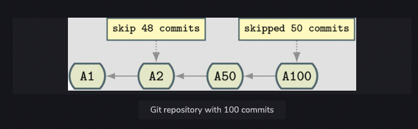
	- Now I clone repo and notice a bug with current state
	- To investigate the issue 
		- First way is to read code, try to debug, do lodding, etc.
		- Second way is to use ``git bisect``
- Choose two scenarios, ``good`` and ``bad`` 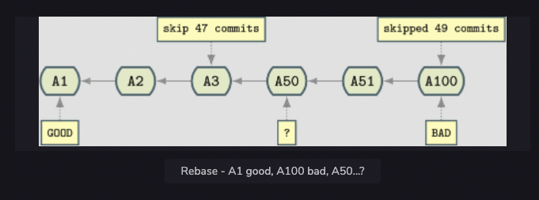
- Now git bisect works by Binary Search method 
- It provides a version that is ``halfway`` in between ``good`` and ``bad`` 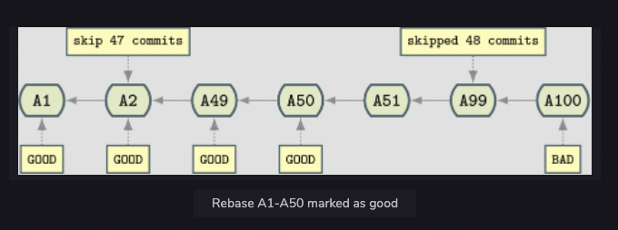
- And carry on above process until the commit where bug arised is found 
- BAD commit found 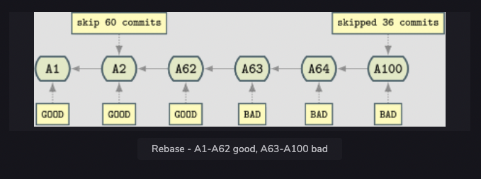
- ```git bisect start
	 git bisect bad
	 git bisect good
  ```
- Repeat until the broken commit is found

### ~ Operator
- Used to move current head to n number of commits back
- Example - ``git checkout HEAD~99`` will result in HEAD moving from commit 100 to commit 1
### ^ Operator
- Used to move to parent commit
- Example - ``git checkout HEAD^99`` will move HEAD to it's parent Commit
### Practice
```git show HEAD^
	 git show HEAD^^
	 git show HEAD^2
	 git show HEAD~1
	 git show HEAD~2
	 git show HEAD~2^1
```

***

## The -X ours flag
- When merging, you can tell Git to use specific strategies to help it decide how to merge and reduce the chances of having to resolve a conflict.
- With ``-X ours`` flag, when faced with a conflict, Git will favor changes made within the current branch over the one being merged in.
***

## Cloning a Repo
- When a repo is cloned, then the origin branch has no visibility of any remotes, but the cloned one does 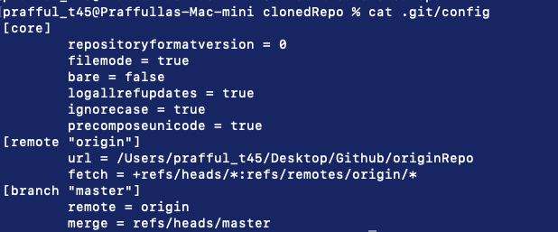 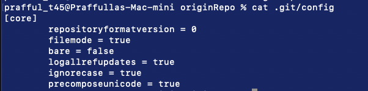
- The files in two repos would have ``identical content``, but their config files would ``differ``
- See contents of ```./git/config``` file for a cloned repo ```cat .git/config```
- It would have entry corresponding to ``origin`` URL
	- URLs can be an ``http://`` or ``https://`` one or even ``ssh://`` or ``git://``
	- ``git://`` is a git specific protocol that is rarely used these days
	- A Git repository cloned with ``git@``, in fact using the ssh:// protocol under the hood.
- ```git remote``` would return name ```origin``` back
- The name ```origin``` is the _default name for a remote_

## Git Fetch and Push and Merge
- Remotes are divided into ``fetch`` and ``pull`` actions
- These relate to two different actions on remotes, ``getting changes from a remote`` and ``pushing changes to a remote``
- ```Fecthing from Remote```
	- The command git fetch gets the latest changes from the remote repository and copies them into the local repository, updating the local copies of any branches that have been changed.
	- These fetched changes are not mixed with local branches but are kept in a separate place in repo.
	- Reference to HEAD pointers to origin are stored under ``.git/refs`` folders files
	- ``git fetch origin branchName`` fetches changes from the specified branch
	- ``git branch --all``, you can see repository is aware of all the branches 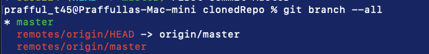
- ```refs folder```
	- ``ls ./git/refs`` under cloned repo after executing Fetch 
	- It has heads, which contains references/commitID's to the local branch: ``cat .git/refs/heads/master`` 
	- And similarly for remote branches: ``cat .git/refs/remotes/origin/master`` 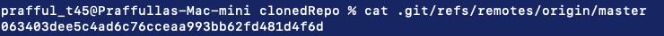
- So now we've fetched the remote branch and have a copy of it locally in cloned repo.
- ``Apply Remote Changes to Local``
	- ``git merge origin/remoteBranchName``
	- ``git log --oneline --graph``
## Git Pull
- ``git pull origin`` combines ``fetch`` and ``merge`` operations simulatneously
***

## Working with Multiple Repo's/Remotes
- How to move changes between multiple remotes !!
- Can add remote reference of branch into another by ``git remote add remoteName ../repoName``
- ``git remote -v`` to see all remotes for current repo 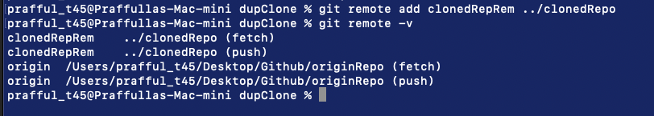
- Changes from Any remote can be fetched now ``git fetch remoteName branchname`` 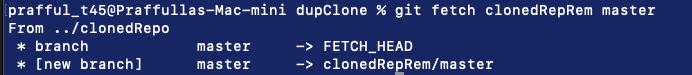
***

## Pushing Code
- ``git push remoteName branchName``, remoteName is ``origin`` by default and next comes your currentBranch name whose changes you want to push
- git will create a branch on you remote repo. if one does not exist already
- ```What if remote repo already contains a branch with same name```
	- An error is thrown 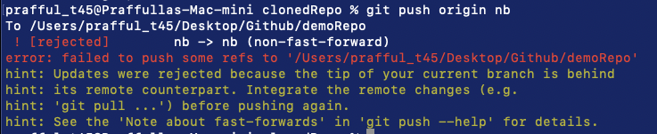
	- ``Updates were rejected because the remote contains work that you do not have locally.``
	- ``This is usually caused by another repository pushing to the same ref.``
	- ``git fetch and merge`` to resolve above error
		- Fix any merge conflicts, add the new file and commit new changes
		- Then try to push again

- ``Tracking remote branches with different names``
	- Just like ``master`` branch on a cloned repo tracks ``origin/master`` on remote repo,.
	- If you want to a ``local branch`` to track any ``remote branch``
		- ``git push --set-upstream remoteName branchName`` OR
		- ``git push -u origin branchName`` 
**

## Git submodules
- Submodules allow you to loosely link different Git repositories together so that they are bundled together.
- At the same time, it ensures that changing one will not break the other.
- Sometimes, you want to include one repository in another but do not want to simply copy it over and have to maintain its changes separately.
- Submodules allow you to manage the separate codebase within your repository without affecting the other repository.
- Git submodules solve external repository dependency issues with a little overhead.
- `` Tracking Copies ``
	- Git submodule commands are Git commands used to track copies of other repositories within your repository.
	- Tracking is under your control (so you decide when it gets updated, regardless of how the other repository moves on
	- The tracking is done within a file that is stored with your Git repository.
- ``git submodule init`` Initialse Submodules
- ``git submodule add repoLink(A)`` Link another repo. as a submodule 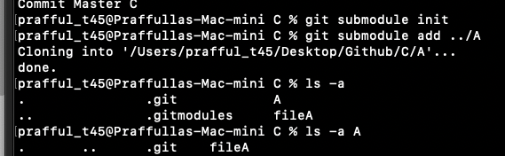
	- Above command will create a ``.gitmodules`` file 
	- And a folder ``repoName(A)`` get's created as well
	- ``repoName(A)`` has been cloned just like any ``git clone`` command
	- ``ls -a repoName(A)``
	- ``.gitmodules`` file tracks where the submodule comes from
	- ``git submodule status`` works similar to ``git status`` command 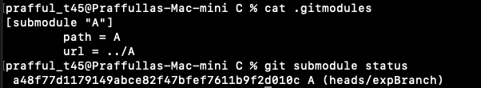
- Since submodule is just a ``clone``, it can be navigated just like any other git repo
- ``git checkout -b firstRepoMaster --track origin/master`` will create a new branch named ``firstRepoMaster`` to track ``origin/master`` of ``repoName(A)`` repo
- Note that ``secondRepo`` tracks the specific commit and not the remote branch.
- This means that changes to ``repoName(A)`` in the origin repository are not automatically tracked within ``secondRepo`` submodule. 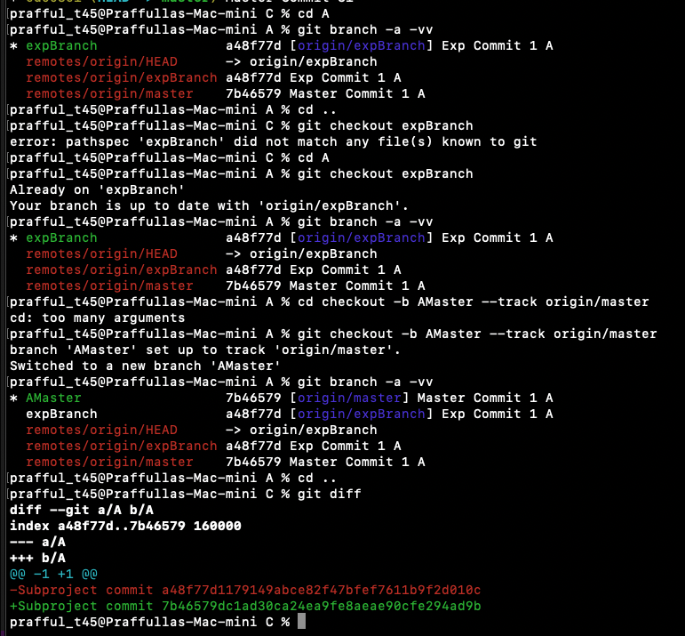
- Even if ``repoName(A)`` has a commit in it's branch, the branch in ``secondRepo`` that tracks ``repoName(A)`` reports everything is up-to-date, since the submodule is tracking a particular commit and not the branch
- ``git pull`` to get latest changes from SubModule branch 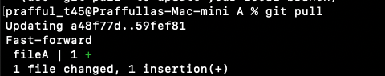
**

## Pull Requests
- A ``pull request`` is a request from a user for another user to accept a change that has been committed elsewhere
- ``git push -u origin myfirstbranchlocal:myfirstbranchremote``, This indicates that the ``local branch myfirstbranchlocal`` should be pushed to the ``remote branch myfirstbranchremote``.
- By default, Git assumes you want to match the names on the local and the remote repository
- Now that you’ve created the tmpbranch on the remote repository, you might decide you’ve been too hasty and that “tmpbranch” is not needed on the remote.
	- To delete it on the remote, specify nothing before the colon like this: ``git push origin :tmpbranch``
	- This has the effect of removing the branch on the remote repository.
- ``git branch -d mybranch`` Delete Local branch
- ``git branch -D abranch``, if branch 'abranch' is not fully merged.
**

## Git Log Flags
- ``git log --graph --oneline --all --decorate --topo-order``
- ``git log --oneline`` use ``-–oneline`` to only show the commit ID and comment per-commit.
- ``git log --oneline --graph`` You can see where merges take place and what commits were merged.
- ``git log --graph --oneline --all`` I want to see all the branches in the history, so I add the ``-–all`` flag.
- ``git log --graph --oneline --all --decorate`` Each remote or type of branch/tag is shown in a different color (even stashes!).
- ``git log --graph --oneline --all --decorate --source`` You can show the ref name on each line by adding ``-–source``
- ``git log --graph --oneline --all --decorate --simplify-by-decoration`` You may want to only see the significant points of change to eliminate all the intermediary commits.
- ``git log --graph --oneline --all --decorate --simplify-by-decoration --pretty=`` You might want to re-introduce the date information
- ``git log --patch``,  patch flag is used to check the changes at each commit
**

## Squashing Commits
- In order to squash a set of commits, you need:
	- A reference to the last (latest) commit of the set you want to squash.
	- A reference to the oldest (first) commit of the set you want to squash.
- ``How to find Reference to oldest commit``, use the ``git rev-list`` command.
- ``git rev-list --max-parents=0 HEAD``, gets you the original commit
- Git assumes that HEAD was the second argument if none was given.
- ``git rebase -i $(git rev-list --max-parents=0 HEAD) HEAD``
**

## Bare repositories
- Bare repositories and ``git push -f`` force push
- ``git init --bare``, initialises a bare repository
- ``flag bare = true`` for bare repositories under ``config`` file
**

## Cherry-picking and 3-way Merging
- ```Three-way merges``` when performing a ``merge or cherry-pick``
	- Git says: “I can’t apply that individual commit here without any conflicts, so I’m going to apply all the diffs between these two points, and let you figure out what’s going on.”
	- This is why it is called a “three-way merge.” 
	- The merge compares the changes between the source (abranchtag), the target (the master branch), and the first common ancestor (9c3f1af above).
	- If there is ``no conflict`` in the change, you ``cherry-pick``, and then the ``three-way merge is not invoked``.
- ``git cherry-pick --abort`` to revert cherry-pick that was started
- ``Generate Patch`` 
	- Create a patch file that has the diff contained in the abranchtag commit within it.
	- Apply that diff to the master branch.
	- ``git diff-tree - abranchtag > abranchtag.patch``
	- Now look at contents of above patch file by ``cat abranchtag.patch``.
- ``Apply Patch``
	- Now that you have the patch for that commit (and only that commit), you can apply it to the master branch: ``cat abranchtag.patch | git apply --reject``
	- conflict you saw before was put in a ``.rej file``.
	- ``.rej`` file is created with the name of the file the conflict relates to and the ``.rej`` appended
**

## Git Hooks
- ``Git hooks`` allow you to control what the Git repository does when certain actions are performed.
- They’re called ``hooks`` because they allow you to hook a script at a specific point in the Git workflow.
- Take a look at the ``git/hooks`` folder
- In the ``.git/hooks`` folder, there are various examples of scripts that can be run at various points in the Git content lifecycle
- ``Create a Hook file``
- ```cat > .git/hooks/pre-commit << EOF
	echo NO WORKING AT WEEKENDS!
	exit 1
	EOF
	chmod +x .git/hooks/pre-commit```
- The script prints a message about not working on weekends and exits with a code of 1, which is a generic error code in a shell script (exit 0 would mean “OK”).
- 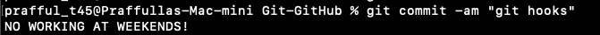
- 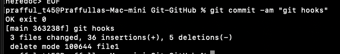
- ``Banning Keywords``
	- ```echo 'a political comment' >> file1
         cat > .git/hooks/pre-commit << EOF
		 if grep -rni politic *
		 then
		 echo 'no politics allowed!'
		 exit 1
		 fi
		 echo OK
		 exit 0
		 EOF
		 git commit -am 'Political comment'```
- Even more sophisticated scripts are possible but require a deeper knowledge of bash
- Hooks don't move as part of repo code, so if the hook has to be transferred it has to be manually added into any clone/fork
- ``Client-Side hook`` and ``Server-side Hook``
- ``pre-commit hook``, a pre-receive script, which will be run when anything is pushed to this repository.
	- ``cat > hooks/pre-receive << 'EOF'
        #!/bin/bash
        read _oldrev newrev _branch
        git cat-file -p $newrev | grep '[A-Z][A-Z]*-[0-9][0-9]*'
        EOF``
	- ``chmod +x hooks/pre-receive`` Make the script executable:
- The read command in the above code is the key one to understand. It reads three variables: _oldrev, newrev, and _branch from standard input (i.e., the data that is coming in to the script). The contents of these variables will match. The previous Git revision reference commit refers to the branch it is committed on. The new Git revision reference commit refers to the branch it is committed on. Git arranges that these references are given to the pre-receive script on standard input so that action can be taken accordingly.

- Then, you use the (previously unseen in this course) git cat-file command to output details of the latest commit value stored in the newrev variable. The output of this latest commit is run through a grep command that looks for a specific string format in the commit message. If the grep finds a match, then it returns no error and all is OK. If it doesn’t find a match, then grep returns an error as does the script.
- This grep only returns successfully if it matches a string that matches the format of a JIRA ticket ID (e.g., PROJ-123). The end effect is to enforce that the last commit being pushed must have a reference to such a ticket ID for it to be accepted. You might want such a policy to ensure that every set of commits can be traced back to a ticket ID.