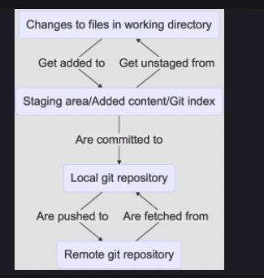
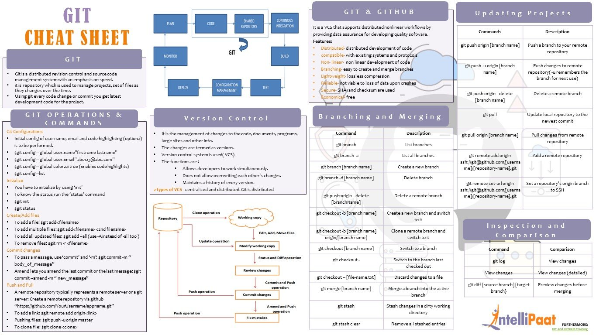
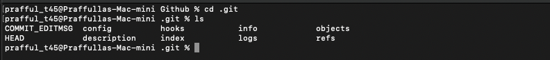
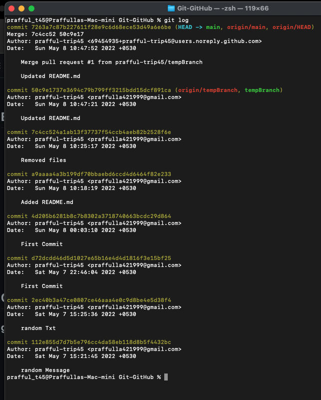
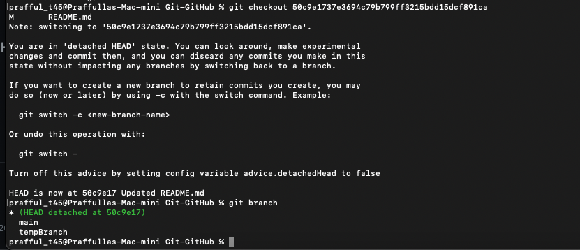
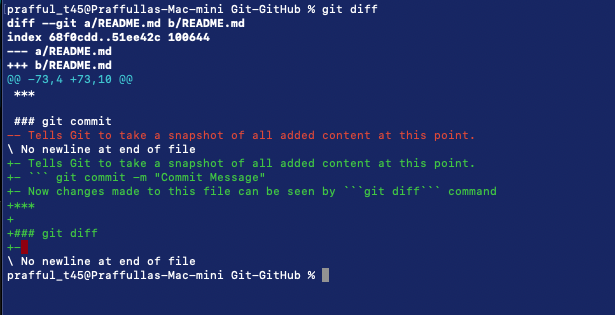
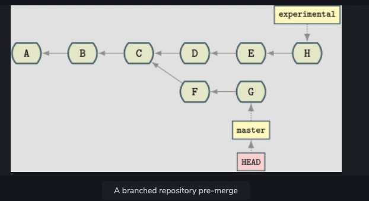
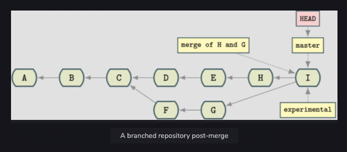

# Github
- Config files are global to the host
- 4 Stages of a File in Git 
- GIT Cheat Sheet 
- - The repo from which current folder was cloned, that remote is given ```origin``` name by default
***

## Errors faced
- Support for password authentication was removed on August 13, 2021. Please use a personal access token instead.
    - Generate Personal Access Token and instead of entering password enter the generated PAT
- Prompt to enter Github username and password every time
    - Configure osxkeychain credential helper
    - ```https://www.atlassian.com/git/tutorials/install-git```
    - Store PAT Under Github Keychain Password
    - Now after you enter username and password for the first time
    - osxkeychain will get store the credentials and you don't need to enter uname and pwd each time you push to main

# Git Commands 
## git init
- Initializes a database in the ```.git folder```
- Repository is entirely stored within this ```.git folder```
- Files within ```.git folder```
    ``` 
    cd .git 
    ls
    ```
    - Files Present 
***

## HEAD File
- This file points to the current branch or commit ID you are currently on
- Inside this file (```cat HEAD```) you can find string ```refs/heads/currentBranch```, this an internal representation of ```currentBranch```
***

## Move HEAD to previous commit
- In order to do so, we'll need the commit hash
- ```git log``` command, copy the commit ID/commit HASH 
- ```git checkout commitHash```, this command will move the current head to particular commit 
- Now if you make changes here you won't be able to push it, as there is no branch created

	#### How to push changes from commitID
	- Add files and commit changes
	- You will get an associated commitID/Hash
	- Create branch out of this commit ID
	- ```git branch branchName commitID/Hash```
	- Now you can push these changes
***

## GIT Config File
- Config file stores info about repo's local configuration 
- ```
	cd .git
	cat config
  ``` 
- 
***

## git log
- Look at repositories history
- ``` git log ``` , hit space+down to scroll output pages
- ```git log oneline```, view the log is ```one line per commit```
- ```git log --oneline --graph```, get a visual representation of the history
***

## git status
- Retrieve Repo's current status, deleted/modified/created files
- ```Untracked Files``` => Git has detected that a file exists, but the repo isn't aware of it, add file to repo to make repo aware of it
***

## git add
- Tells git repo to starts tracking the file in the local index
- ```git add fileName```
- Adds a file to the index. It is ready to be committed to the repository.
- Still, the file won't have any history! Git has simply been made aware of the file, and you must make a commit to initiate Git’s history.
***

## git commit
- Tells Git to take a snapshot of all added content at this point.
- ``` git commit -m "Commit Message"
- Now changes made to this file can be seen by ```git diff``` command
***

## git diff
- Look at local file changes 
***

## Simultaneous Add and commit
- ```git commit -am "Commit Message"```
***

## git clone
- Create Local copies of git repositories to work with
***

## git reset
- Command to return to a prvious known state
- Types of reset in git
	- ```soft``` : only changes HEAD, but doesn’t change staged files in index or working files, just moves HEAD ,no alteration to added/staged files or modified files
	- ```mixed```: moves HEAD and updates the index with the contents of the revision to which HEAD now points
		- Takes items out of their added status but keeps them altered in the current working folder	--> ```default reset flag used```.
	- ```hard``` : --hard not only takes items out of their added status, but they also make the working tree state consistent with what was last committed. You can effectively lose your changes with the --hard flag.
***

## Removed files by mistake, Recover it !!
- ```rm -rf ../Git-Github/*```
- Above command deletes your cloned repo.
- But ```.git``` folder is skipped from deletion
- The ```*``` character does not match any file starting with ```.```
- Restore
	- ```git reset``` to recover the state of Git repo
	- By default, Git will recover whatever has been added to the index/staging area an place it in your working directory
	- ```git reset --hard```  will reset all local and added changes, reverting your checkout to a just-cloned and committed state.
***

## git branch
- ```git branch newBranch```
***

## git checkout
- Switch to a branch ```git checkout branchName```
***

## Detached 
- **Detaching**
	- The HEAD pointer can move to any arbitrary point, achieved by ```git checkout```
	- Specify a reference / commit ID 
	- ``` git checkout e36355ed00ac3af009d7113a9dd281c269a79afd```
	- **Detached HEAD** just means that the HEAD pointer is not pointed to any branch right now
	- Instead it is pointing to a commit ID
***

## Tags
- Tags are the same as branches, except they do not have history. They point to a particular commit, but it doesn't change
- ```git tag i_was_here```
***

## Merging
- Merging is the opposite of branching
- When you merge, you take two separate points in your development tree and fuse them together
- ```git merge firstBranchName secondBranchName```
- Pre Merge repo tree 
- Post Merge repo tree 
### Merge Conflicts
- temp changes
- temp changes 2
***

## git stash
- TBD
***

